[kubeadm集群搭建步骤](./kubeadm_cluster.md)

[kubeadm高可用集群搭建步骤](./kubeadm_high_availability_cluster.md)

# 1 k8s基本介绍

kubernetes，简称 K8s，是用 8 代替 8 个字符“ubernete”而成的缩写。是一个开源的，用于管理云平台中多个主机上的容器化的应用，Kubernetes 的目标是让部署容器化的应用简单并且高效（powerful）,Kubernetes 提供了应用部署，规划，更新，维护的一种机制。

传统的应用部署方式是通过插件或脚本来安装应用。这样做的缺点是应用的运行、配置、管理、所有生存周期将与当前操作系统绑定，这样做并不利于应用的升级更新/回滚等操作，当然也可以通过创建虚拟机的方式来实现某些功能，但是虚拟机非常重，并不利于可移植性。

新的方式是通过部署容器方式实现，每个容器之间互相隔离，每个容器有自己的文件系统 ，容器之间进程不会相互影响，能区分计算资源。相对于虚拟机，容器能快速部署，由于容器与底层设施、机器文件系统解耦的，所以它能在不同云、不同版本操作系统间进行迁移。

容器占用资源少、部署快，每个应用可以被打包成一个容器镜像，每个应用与容器间成一对一关系也使容器有更大优势，使用容器可以在 build 或 release 的阶段，为应用创建容器镜像，因为每个应用不需要与其余的应用堆栈组合，也不依赖于生产环境基础结构，这使得从研发到测试、生产能提供一致环境。类似地，容器比虚拟机轻量、更“透明”，这更便于监控和管理。

Kubernetes 是 Google 开源的一个容器编排引擎，它支持自动化部署、大规模可伸缩、应用容器化管理。在生产环境中部署一个应用程序时，通常要部署该应用的多个实例以便对应用请求进行负载均衡。

在 Kubernetes 中，我们可以创建多个容器，每个容器里面运行一个应用实例，然后通过内置的负载均衡策略，实现对这一组应用实例的管理、发现、访问，而这些细节都不需要运维人员去进行复杂的手工配置和处理。

# 2 功能与架构

## 2.1  概述

Kubernetes 是一个轻便的和可扩展的开源平台，用于管理容器化应用和服务。通过Kubernetes 能够进行应用的自动化部署和扩缩容。在 Kubernetes 中，会将组成应用的容器组合成一个逻辑单元以更易管理和发现。Kubernetes 积累了作为 Google 生产环境运行工作负载 15 年的经验，并吸收了来自于社区的最佳想法和实践。

## 2.2 功能

> 自动装箱

基于容器对应用运行环境的资源配置要求自动部署应用容器

> 自我修复( 自愈能力 )

当容器失败时，会对容器进行重启当所部署的 Node 节点有问题时，会对容器进行重新部署和重新调度当容器未通过监控检查时，会关闭此容器直到

容器正常运行时，才会对外提供服务

> 水平扩展

通过简单的命令、用户 UI 界面或基于 CPU 等资源使用情况，对应用容器进行规模扩大或规模剪裁

> 服务发现

用户不需使用额外的服务发现机制，就能够基于 Kubernetes 自身能力实现服务发现和负载均衡

> 滚动更新

可以根据应用的变化，对应用容器运行的应用，进行一次性或批量式更新

> 版本回退

可以根据应用部署情况，对应用容器运行的应用，进行历史版本即时回退

> 密钥和配置管理

在不需要重新构建镜像的情况下，可以部署和更新密钥和应用配置，类似热部署。

> 存储编排

自动实现存储系统挂载及应用，特别对有状态应用实现数据持久化非常重要存储系统可以来自于本地目录、网络存储(NFS、Gluster、Ceph 等)、公

共云存储服务

> 批处理

提供一次性任务，定时任务；满足批量数据处理和分析的场景

## 2.3 应用部署架构分类

> 无中心节点架构

GlusterFS

> 有中心节点架构

HDFS

## 2.4 集群架构

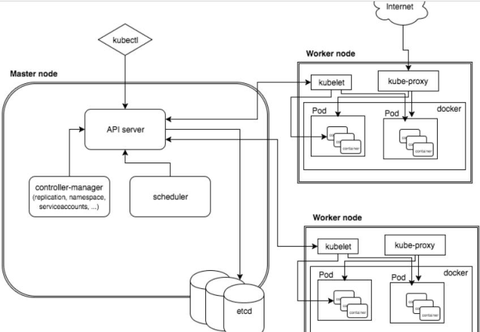

> Master node

k8s 集群控制节点，对集群进行调度管理，接受集群外用户去集群操作请求

Master Node 由 API Server、Scheduler、ClusterState Store（ETCD 数据库）和Controller MangerServer 所组成

> Worker node

集群工作节点，运行用户业务应用容器

Worker Node 包含 kubelet、kube proxy 和 ContainerRuntime

> Master组件

* `apiserver` 集群统一入口，以restful方式交给etcd存储
* `scheduler` 节点调度，选择node节点应用部署
* `controller-manager` 处理集群中常规后台任务，一个资源对应一个控制器
* `etcd` 存储系统，用于保存集群相关数据

> Node组件

* `kubelet` master派到node节点的代表，管理本机容器
* `kube-proxy` 提供网络代理，负载均衡等操作

# 3 核心概念

## 3.1 pod

* 最小部署单元
* 一组容器的集合
* 共享网络
* 生命周期短暂

## 3.2 controller

* 确保预期的pod副本数量
* 无状态、有状态应用部署
* 确保所有node运行同一个pod
* 一次性任务和定时任务

## 3.3 service

* 定义一组pod的访问规则

# 4  集群搭建(kubeadm方式)

[集群搭建步骤](./kubeadm_cluster.md)

## 4.1 前置知识点

目前生产部署 Kubernetes 集群主要有两种方式：

> kubeadm

Kubeadm 是一个 K8s 部署工具，提供 kubeadm init 和 kubeadm join，用于快速部署 Kubernetes 集群。

[官方地址](https://kubernetes.io/docs/reference/setup-tools/kubeadm/kubeadm/)

> 二进制包

从 github 下载发行版的二进制包，手动部署每个组件，组成 Kubernetes 集群。Kubeadm 降低部署门槛，但屏蔽了很多细节，遇到问题很难排查。如果想更容易可控，推荐使用二进制包部署 Kubernetes 集群，虽然手动部署麻烦点，期间可以学习很多工作原理，也利于后期维护。

## 4.2 kubeadm部署方式介绍

kubeadm 是官方社区推出的一个用于快速部署 kubernetes 集群的工具，这个工具能通过两条指令完成一个 kubernetes 集群的部署：

1. 创建一个 Master 节点 kubeadm init
2. 将 Node 节点加入到当前集群中 `$ kubeadm join <Master 节点的 IP 和端口 >`

## 4.3 最终目标

1. 在所有节点上安装 Docker 和 kubeadm
2. 部署 Kubernetes Master
3. 部署容器网络插件
4. 部署 Kubernetes Node，将节点加入 Kubernetes 集群中
5. 部署 Dashboard Web 页面，可视化查看 Kubernetes 资源

# 5. 集群搭建(二进制方式)

1. 设置多台虚拟机，安装Linux
2. 初始化系统，包括防火墙等设置，保证机器之间可通信
3. 为etcd和apiserver自签证书
4. 部署etcd集群
5. 部署master组件
6. 部署node组件
7. 部署集群网络

# 6. K8s集群命令行工具kubectl

## 6.1 kubectl概述

kubectl是k8s集群的命令行工具，通过kubectl能够对集群本身进行管理，并能够在集群上进行容器化应用的安装部署。

## 6.2 命令语法

```bash
kubectl [command] [TYPE] [NAME] [flags]
command: 指定要对资源执行的操作，如create, get, describe, delete
TYPE: 指定资源类型，资源类型是大小写敏感的，开发者能够以单数、复数和缩略的形式。
例如:
	kubectl get pod pod1
	kubectl get pods pod1
	kubectl get po pod1
NAME: 指定资源的名称，名称也大小写敏感的。如果省略名称，则会显示所有的资源
例如:
	kubectl get pods
flags: 指定可选的参数。例如，可用-s 或者–server 参数指定 Kubernetes APIserver 的地址和端口
```

使用`kubelctl --help`获取更多信息

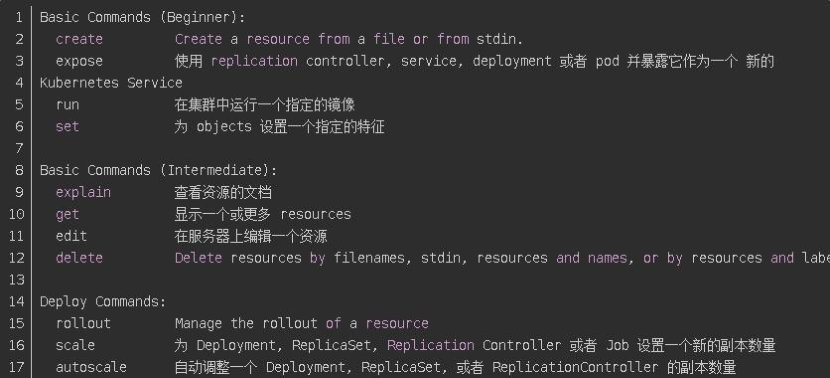

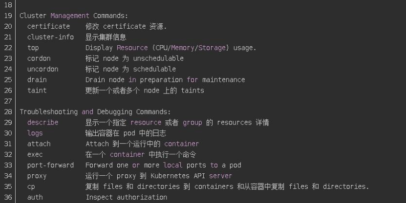

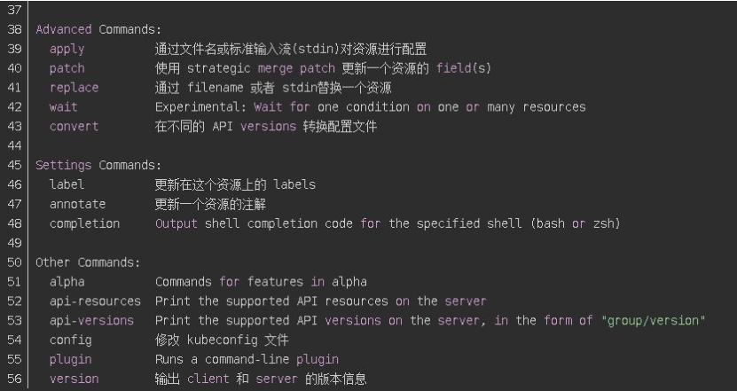

# 7. 核心概念 -- pod

## 7.1 pod概述

Pod 是 k8s 系统中可以创建和管理的最小单元，是资源对象模型中由用户创建或部署的最小资源对象模型，也是在 k8s 上运行容器化应用的资源对象，其他的资源对象都是用来支撑或者扩展 Pod 对象功能的，比如控制器对象是用来管控 Pod 对象的，Service 或者Ingress 资源对象是用来暴露 Pod 引用对象的，PersistentVolume 资源对象是用来为 Pod提供存储等等，k8s 不会直接处理容器，而是 Pod，Pod 是由一个或多个 container 组成

Pod 是 Kubernetes 的最重要概念，每一个Pod都有一个特殊的被称为”根容器“的 Pause容器。Pause 容器对应的镜像属于 Kubernetes 平台的一部分，除了Pause容器，每个Pod还包含一个或多个紧密相关的用户业务容器

类似于docker-compose

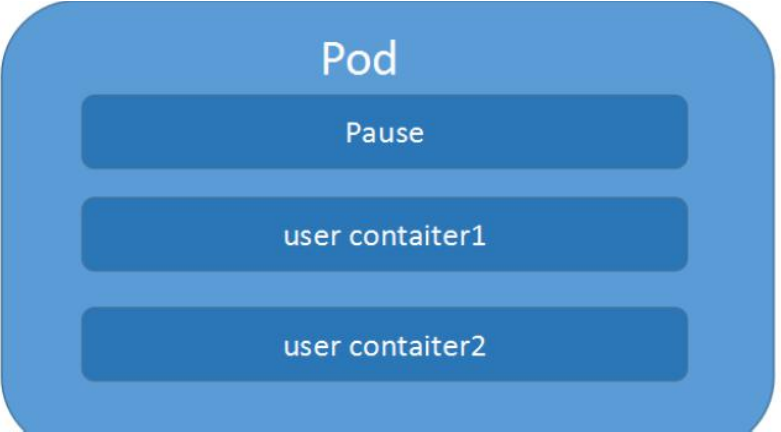

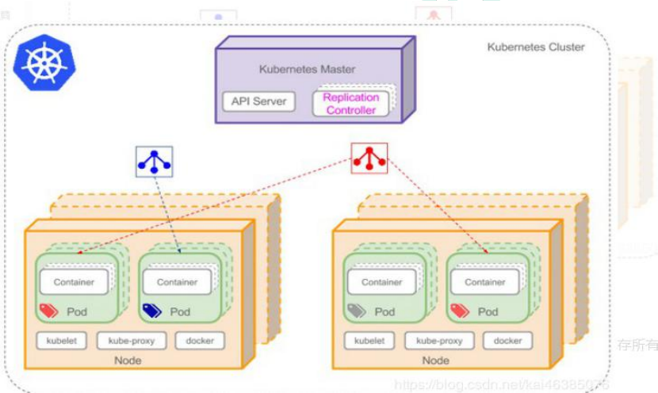

> Pod vs 应用

每个 Pod 都是应用的一个实例，有专用的 IP

> Pod vs 容器

一个 Pod 可以有多个容器，彼此间共享网络和存储资源，每个 Pod 中有一个 Pause 容器保存所有的容器状态， 通过管理 pause 容器，达到管理 pod 中所有容器的效果

> Pod vs 节点

同一个 Pod 中的容器总会被调度到相同 Node 节点，不同节点间 Pod 的通信基于虚拟二层网络技术实现

> Pod vs Pod

普通Pod和静态Pod

## 7.2 pod实现机制

> 资源共享

一个 Pod 里的多个容器可以**共享存储和网络**，可以看作一个逻辑的主机。共享的如namespace, groups 或者其他的隔离资源。

共享网络：多个容器共享同一 network namespace，由此在一个 Pod 里的多个容器共享 Pod 的 IP 和端口 namespace，所以一个 Pod 内的多个容器之间可以通过 localhost 来进行通信,所需要注意的是不同容器要注意不要有端口冲突即可。不同的 Pod 有不同的 IP,不同 Pod 内的多个容器之前通信，不可以使用 IPC（如果没有特殊指定的话）通信，通常情况下使用 Pod的 IP 进行通信。

共享存储：一个 Pod 里的多个容器可以共享存储卷volume，这个存储卷会被定义为 Pod 的一部分，并且可以挂载到该 Pod 里的所有容器的文件系统上。

> 生命周期短暂

Pod 属于生命周期比较短暂的组件，比如，当 Pod 所在节点发生故障，那么该节点上的 Pod会被调度到其他节点，但需要注意的是，被重新调度的 Pod 是一个全新的 Pod,跟之前的Pod 没有任何关系。

> 平坦的网络

K8s 集群中的所有 Pod 都在同一个共享网络地址空间中，也就是说每个 Pod 都可以通过其他 Pod 的 IP 地址来实现访问

## 7.3 yaml配置

```yaml
apiVersion: v1             #指定api版本，此值必须在kubectl apiversion中  
kind: Pod                  #指定创建资源的角色/类型  
metadata:                  #资源的元数据/属性  
  name: django-pod         #资源的名字，在同一个namespace中必须唯一  
  labels:                  #设定资源的标签，使这个标签在service网络中备案，以便被获知
    k8s-app: django
    version: v1  
    kubernetes.io/cluster-service: "true"  
  annotations:             #设置自定义注解列表  
     - name: String        #设置自定义注解名字  
spec:                      #设置该资源的内容  
  restartPolicy: Always    #重启策略:
                             #Always: 当容器终止退出后，总是重启容器，默认
                             #OnFailure: 当容器异常退出时才重启容器
                             #Never: 当容器终止退出后，从不重启容器
  nodeSelector:            #可以根据环境选择node，比如生产和测试环境
  containers:  
  - name: django-pod       #容器的名字  
    image: django:v1.1     #容器使用的镜像地址  
    imagePullPolicy: Always #三个选择Always、Never、IfNotPresent，每次启动时检查和更新（从registery）images的策略，
                             #Always: 每次都检查
                             #Never: 每次都不检查（不管本地是否有）
                             #IfNotPresent: 如果本地有就不检查，如果没有就拉取
    command: ['sh']        #启动容器的运行命令，将覆盖容器中的Entrypoint,对应Dockefile中的ENTRYPOINT  
    args: ["$(str)"]       #启动容器的命令参数，对应Dockerfile中CMD参数  
    env:                   #指定容器中的环境变量  
    - name: str            #变量的名字  
      value: "/etc/run.sh" #变量的值  
    resources:             #资源管理
      requests:            #容器运行时，最低资源需求，也就是说最少需要多少资源容器才能正常运行  
      cpu: 0.1             #CPU资源（核数），两种方式，浮点数或者是整数+m，0.1=100m，最少值为0.001核（1m）
        memory: 32Mi       #内存使用量  
      limits:              #资源限制  
        cpu: 0.5  
        memory: 32Mi  
    ports:  
    - containerPort: 8080    #容器开发对外的端口
      name: uwsgi          #名称
      protocol: TCP  
    livenessProbe:         #pod内容器健康检查的设置
      httpGet:             #通过httpget检查健康，返回200-399之间，则认为容器正常  
        path: /            #URI地址  
        port: 8080  
        #host: 127.0.0.1   #主机地址  
        scheme: HTTP  
      initialDelaySeconds: 180 #表明第一次检测在容器启动后多长时间后开始  
      timeoutSeconds: 5    #检测的超时时间  
      periodSeconds: 15    #检查间隔时间  
      #也可以用这种方法  
      #exec: 执行命令的方法进行监测，如果其退出码不为0，则认为容器正常  
      #  command:  
      #    - cat  
      #    - /tmp/health  
      #也可以用这种方法  
      #tcpSocket: //通过tcpSocket检查健康   
      #  port: number   
    lifecycle:             #生命周期管理(钩子)  
      postStart:           #容器运行之前运行的任务  
        exec:  
          command:  
            - 'sh'  
            - 'yum upgrade -y'  
      preStop:             #容器关闭之前运行的任务  
        exec:  
          command: ['service httpd stop']  
    volumeMounts:          #挂载设置
    - name: volume         #挂载设备的名字，与volumes[*].name 需要对应    
      mountPath: /data     #挂载到容器的某个路径下  
      readOnly: True  
  affinity:
  	nodeAffinity:										#节点亲和性
  		requiredDuringScheduingIgnoreDuringExecution: 	#硬亲和性，表示必须满足条件。软亲和性已弃用
  			nodeSelectorTerms:
  			- matchExpressions:
  				- key: env role
  				  operator: In
  				  values:
  				  - dev
  				  - test
  volumes:                 #定义一组挂载设备  
  - name: volume           #定义一个挂载设备的名字  
    #meptyDir: {}  
    hostPath:  
      path: /opt           #挂载设备类型为hostPath，路径为宿主机下的/opt
```

## 7.4 Pod的分类

Pod  有两种类型

> 普通  Pod

普通 Pod 一旦被创建，就会被放入到 etcd 中存储，随后会被 Kubernetes Master 调度到某个具体的 Node 上并进行绑定，随后该 Pod 对应的 Node 上的 kubelet 进程实例化成一组相关的 Docker 容器并启动起来。在默认情况下，当 Pod 里某个容器停止时，Kubernetes 会自动检测到这个问题并且重新启动这个 Pod 里某所有容器， 如果 Pod 所在的 Node 宕机，则会将这个 Node 上的所有 Pod 重新调度到其它节点上。

> 静态  Pod

静态 Pod 是由 kubelet 进行管理的仅存在于特定 Node 上的 Pod,它们不能通过 API Server进行管理，无法与 ReplicationController、Deployment 或 DaemonSet 进行关联，并且kubelet 也无法对它们进行健康检查。

# 8. 核心技术 -- controller

## 8.1 Replication Controller

Replication Controller(RC)是 Kubernetes 系统中核心概念之一，当我们定义了一个 RC并提交到 Kubernetes 集群中以后，Master 节点上的 Controller Manager 组件就得到通知，定期检查系统中存活的 Pod,并确保目标 Pod 实例的数量刚好等于 RC 的预期值，如果有过多或过少的 Pod 运行，系统就会停掉或创建一些 Pod.此外我们也可以通过修改 RC 的副本数量，来实现 Pod 的动态缩放功能。

```bash
kubectl scale rc nginx --replicas=5
```

由于 Replication Controller 与 Kubernetes 代码中的模块 Replication Controller 同名，所以在 Kubernetes v1.2 时， 它就升级成了另外一个新的概念 Replica Sets,官方解释为下一代的 RC，它与 RC 区别是:Replica Sets 支援基于集合的 Label selector,而 RC 只支持基于等式的 Label Selector。我们很少单独使用 Replica Set,它主要被 Deployment 这个更高层面的资源对象所使用，从而形成一整套 Pod 创建、删除、更新的编排机制。最好不要越过 RC 直接创建 Pod， 因为 Replication Controller 会通过 RC 管理 Pod 副本，实现自动创建、补足、替换、删除 Pod 副本，这样就能提高应用的容灾能力，减少由于节点崩溃等意外状况造成的损失。即使应用程序只有一个 Pod 副本，也强烈建议使用 RC 来 定义 Pod

## 8.2 Replica Set

ReplicaSet 跟 ReplicationController 没有本质的不同，只是名字不一样，并且ReplicaSet 支持集合式的 selector（ReplicationController 仅支持等式）。

Kubernetes 官方强烈建议避免直接使用 ReplicaSet，而应该通过 Deployment 来创建 RS 和Pod。由于 ReplicaSet 是 ReplicationController 的代替物，因此用法基本相同，唯一的区别在于 ReplicaSet 支持集合式的 selector。

## 8.3 Horizontal Pod Autoscaler

Horizontal Pod Autoscal(Pod 横向扩容 简称 HPA)与 RC、Deployment 一样，也属于一种Kubernetes 资源对象。通过追踪分析 RC 控制的所有目标 Pod 的负载变化情况，来确定是否需要针对性地调整目标 Pod 的副本数，这是 HPA 的 实现原理。Kubernetes 对 Pod 扩容与缩容提供了手动和自动两种模式，手动模式通过 kubectl scale命令对一个 Deployment/RC 进行 Pod 副本数量的设置。自动模式则需要用户根据某个性能指标或者自定义业务指标，并指定 Pod 副本数量的范围，系统将自动在这个范围内根据性能指标的变化进行调整。

1. 手动扩容和缩容

   ```bash
   kubectl scale deployment frontend --replicas 1
   ```

   

2. 自动扩容和缩容

HPA 控制器基本 Master 的 kube-controller-manager 服务启动参数 --horizontal-pod-autoscaler-sync-period 定义的时长(默认值为 30s),周期性地监测 Pod 的 CPU 使用率，并在满足条件时对 RC 或 Deployment 中的 Pod 副 本数量进行调整，以符合用户定义的平均Pod CPU 使用率。

# 9 核心技术 -- Volume

Volume 是 Pod 中能够被多个容器访问的共享目录。Kubernetes 的 Volume 定义在 Pod 上，它被一个 Pod 中的多个容 器挂载到具体的文件目录下。Volume 与 Pod 的生命周期相同，但与容器的生命周期不相关，当容器终止或重启时，Volume 中的数据也不会丢失。

要使用volume，pod 需要指定 volume 的类型和内容（ 字段），和映射到容器的位置（ 字段）。Kubernetes 支持多种类型的 Volume,包括：emptyDir、hostPath、gcePersistentDisk、awsElasticBlockStore、nfs、iscsi、flocker、glusterfs、rbd、cephfs、gitRepo、secret、persistentVolumeClaim、downwardAPI、azureFileVolume、azureDisk、vsphereVolume、Quobyte、PortworxVolume、ScaleIO。

emptyDirEmptyDir 类型的 volume创建于 pod 被调度到某个宿主机上的时候，而同一个 pod 内的容器都能读写 EmptyDir 中的同一个文件。一旦这个 pod 离开了这个宿主机，EmptyDir 中的数据就会被永久删除。所以目前 EmptyDir 类型的 volume 主要用作临时空间，比如 Web 服务器写日志或者 tmp 文件需要的临时目录。

## 9.1 hostPath

HostPath 属性的 volume 使得对应的容器能够访问当前宿主机上的指定目录。例如，需要运行一个访问 Docker 系统目录的容器，那么就使用/var/lib/docker 目录作为一个HostDir 类型的 volume

或者要在一个容器内部运行 CAdvisor，那么就使用/dev/cgroups目录作为一个 HostDir 类型的 volume。一旦这个 pod 离开了这个宿主机，HostDir 中的数据虽然不会被永久删除，但数据也不会随 pod 迁移到其他宿主机上。因此，需要 注意的是，由于各个宿主机上的文件系统结构和内容并不一定完全相同，所以相同 pod 的 HostDir 可能会在不 同的宿主机上表现出不同的行为。

# 10 核心技术 -- PVC & PV

## 10.1 基本概念

管理存储是管理计算的一个明显问题。该 PersistentVolume 子系统为用户和管理员提供了一个 API，用于抽象如何根据消费方式提供存储的详细信息。为此，我们引入了两个新的API 资源：PersistentVolume 和 PersistentVolumeClaim

PersistentVolume（PV）是集群中由管理员配置的一段网络存储。 它是集群中的资源，就像节点是集群资源一样。 PV 是容量插件，如 Volumes，但其生命周期独立于使用 PV 的任何单个 pod。 此 API 对象捕获存储实现的详细信息，包括 NFS，iSCSI 或特定于云提供程序的存储系统。

PersistentVolumeClaim（PVC）是由用户进行存储的请求。 它类似于 pod。 Pod 消耗节点资源，PVC 消耗 PV 资源。Pod 可以请求特定级别的资源（CPU 和内存）。声明可以请求特定的大小和访问模式（例如，可以一次读/写或多次只读）。

虽然 PersistentVolumeClaims 允许用户使用抽象存储资源，但是 PersistentVolumes 对于不同的问题，用户通常需要具有不同属性（例如性能）。群集管理员需要能够提供各种PersistentVolumes 不同的方式，而不仅仅是大小和访问模式，而不会让用户了解这些卷的实现方式。对于这些需求，有 StorageClass 资源。

StorageClass 为管理员提供了一种描述他们提供的存储的“类”的方法。 不同的类可能映射到服务质量级别，或备份策略，或者由群集管理员确定的任意策略。 Kubernetes 本身对于什么类别代表是不言而喻的。 这个概念有时在其他存储系统中称为“配置文件”。

PVC 和 PV 是一一对应的。

## 10.2 生命周期

PV 是群集中的资源。PVC 是对这些资源的请求，并且还充当对资源的检查。PV 和 PVC 之间的相互作用遵循以下生命周期：

**Provisioning  ——>  Binding  ——–> Using ——> Releasing ——> Recycling**

供应准备 Provisioning---通过集群外的存储系统或者云平台来提供存储持久化支持。

- 静态提供 Static：集群管理员创建多个 PV。 它们携带可供集群用户使用的真实存储的详细信息。 它们存在于 Kubernetes API 中，可用于消费
- 动态提供 Dynamic：当管理员创建的静态 PV 都不匹配用户的 PersistentVolumeClaim时，集群可能会尝试为 PVC 动态配置卷。 此配置基于 StorageClasses：PVC 必须请求一个类，并且管理员必须已创建并配置该类才能进行动态配置。 要求该类的声明有效地为自己禁用动态配置。
  - 绑定 Binding---用户创建 pvc 并指定需要的资源和访问模式。在找到可用 pv 之前，pvc会保持未绑定状态。
  - 使用 Using---用户可在 pod 中像 volume 一样使用 pvc。
  - 释放 Releasing---用户删除 pvc 来回收存储资源，pv 将变成“released”状态。由于还保留着之前的数据，这些数据需要根据不同的策略来处理，否则这些存储资源无法被其他pvc 使用。
  - 回收 Recycling---pv 可以设置三种回收策略：保留（Retain），回收（Recycle）和删除
    （Delete）。
- 保留策略：允许人工处理保留的数据。
- 删除策略：将删除 pv 和外部关联的存储资源，需要插件支持。
- 回收策略：将执行清除操作，之后可以被新的 pvc 使用，需要插件支持

## 10.3 PV类型

* GCEPersistentDisk
* AWSElasticBlockStore
* AzureFile
* AzureDisk
* FC (Fibre Channel)
* Flexvolume
* Flocker
* NFS
* iSCSI
* RBD (Ceph Block Device)
* CephFS
* Cinder (OpenStack block storage)
* Glusterfs
* VsphereVolume
* Quobyte Volumes
* HostPath (Single node testing only – local storage is not supported in any
* way and WILL NOT WORK in a multi-node cluster)
* Portworx Volumes
* ScaleIO Volumes
* StorageOS

## 10.4  PV卷阶段状态

`Available` – 资源尚未被 claim 使用

`Bound` – 卷已经被绑定到 claim 了

`Released` – claim 被删除，卷处于释放状态，但未被集群回收。

`Failed` – 卷自动回收失败

# 11 核心技术 -- namespace

Namespace 在很多情况下用于实现多用户的资源隔离，通过将集群内部的资源对象分配到不同的 Namespace 中， 形成逻辑上的分组，便于不同的分组在共享使用整个集群的资源同时还能被分别管理。Kubernetes 集群在启动后，会创建一个名为"default"的 Namespace，如果不特别指明 Namespace,则用户创建的 Pod，RC，Service 都将 被系统 创建到这个默认的名为 default 的 Namespace 中。

# 12 核心技术 -- service(重要)

## 12.1 Service概述

Service 是 Kubernetes 最核心概念，通过创建 Service,可以为一组具有相同功能的容器应用提供一个统一的入口地 址，并且将请求负载分发到后端的各个容器应用上。

## 12.2 Service的定义

yaml 格式的 Service 定义文件

```yaml
apiVersion: v1 kind: Service matadata:
name: string namespace: string labels:
-name: string annotations:
-name: string spec:
selector: [] type: string clusterIP: string
sessionAffinity: string ports:
-name: string protocol: string port: int targetPort: int nodePort: int
status: loadBalancer:
ingress:
ip: string hostname: string
```

## 12.3 常见类型

1. `ClusterIP` 集群内部使用
2. `NodePort` 对外访问应用使用
3. `LoadBalancer` 对外访问应用使用（公有云）

## 13 核心技术 -- Secret

## 13.1 Secret存在意义

加密数据存在etcd里面，让pod容器以挂载volume方式进行访问

Secret 解决了密码、token、密钥等敏感数据的配置问题，而不需要把这些敏感数据暴露到镜像或者 Pod Spec 中。Secret 可以以 Volume 或者环境变量的方式使用

## 13.2 Secret 有三种类型

• Service Account :用来访问 Kubernetes API,由 Kubernetes 自动创建，并且会自动挂
载到 Pod 的/run/secrets/kubernetes.io/serviceaccount 目录中

• Opaque : base64 编码格式的 Secret,用来存储密码、密钥等

• kubernetes.io/dockerconfigjson ：用来存储私有 docker registry 的认证信息

# 14 核心技术 -- 探针

## 14.1 探针类型

K8s 中存在两种类型的探针：liveness probe 和 readiness probe。

## 14.2 liveness probe（存活探针）

用于判断容器是否存活，即 Pod 是否为 running 状态，如果 LivenessProbe 探针探测到容器不健康，则 kubelet 将 kill 掉容器，并根据容器的重启策略是否重启。

如果一个容器不包含 LivenessProbe 探针，则 Kubelet 认为容器的 LivenessProbe 探针的返回值永远成功。有时应用程序可能因为某些原因（后端服务故障等）导致暂时无法对外提供服务，但应用软件没有终止，导致 K8S 无法隔离有故障的 pod，调用者可能会访问到有故障的 pod，导致业务不稳定。K8S 提供 livenessProbe 来检测应用程序是否正常运行，并且对相应状况进行相应的补救措施。

## 14.3 readiness probe（就绪探针）

用于判断容器是否启动完成，即容器的 Ready 是否为 True，可以接收请求，如果ReadinessProbe 探测失败，则容器的 Ready 将为 False，控制器将此 Pod 的 Endpoint 从对应的 service 的 Endpoint 列表中移除，从此不再将任何请求调度此 Pod 上，直到下次探测成功。通过使用 Readiness 探针，Kubernetes 能够等待应用程序完全启动，然后才允许服务将流量发送到新副本。

比如使用 tomcat 的应用程序来说，并不是简单地说 tomcat 启动成功就可以对外提供服务的，还需要等待 spring 容器初始化，数据库连接没连上等等。对于 spring boot 应用，默认的 actuator 带有/health 接口，可以用来进行启动成功的判断。

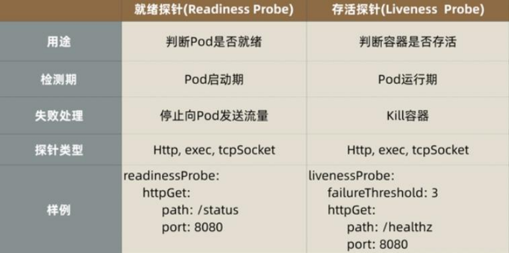

## 14.4 三种探测方法

> exec

通过执行命令来检查服务是否正常，针对复杂检测或无 HTTP 接口的服务，命令返回值为 0 则表示容器健康。

> httpGet

通过发送 http 请求检查服务是否正常，返回 200-399 状态码则表明容器健康。

> tcpSocket

通过容器的 IP 和 Port 执行 TCP 检查，如果能够建立 TCP 连接，则表明容器健康。

## 14.5 探针探测的结果

> Success

Container 通过了检查。

> Failure

Container 未通过检查。

> Unknown

未能执行检查，因此不采取任何措施。

## 14.6 Pod  重启策略

> Always:

总是重启

> OnFailure:

如果失败就重启

> Never:

永远不重启

# 15 核心技术 -- 调度器

## 15.1 概述

一个容器平台的主要功能就是为容器分配运行时所需要的计算，存储和网络资源。容器调度系统负责选择在最合适的主机上启动容器，并且将它们关联起来。它必须能够自动的处理容器故障并且能够在更多的主机上自动启动更多的容器来应对更多的应用访问。目前三大主流的容器平台 Swarm, Mesos 和 Kubernetes 具有不同的容器调度系统。

1. Swarm 的特点是直接调度 Docker 容器，并且提供和标准 Docker API 一致的 API。
2. Mesos 针对不同的运行框架采用相对独立的调度系统，其中 Marathon 框架提供了 Docker容器的原生支持。
3. Kubernetes 则采用了 Pod 和 Label 这样的概念把容器组合成一个个的互相存在依赖关系的逻辑单元。相关容器被组合成 Pod 后被共同部署和调度，形成服务（Service）。这个是 Kubernetes 和 Swarm，Mesos 的主要区别。

相对来说，Kubernetes 采用这样的方式简化了集群范围内相关容器被共同调度管理的复杂
性。换一种角度来看，Kubernetes 采用这种方式能够相对容易的支持更强大，更复杂的容
器调度算法。

## 15.2 调度工作方式

Kubernetes 调度器作为集群的大脑，在如何提高集群的资源利用率、保证集群中服务的稳定运行中也会变得越来越重要

Kubernetes 的资源分为两种属性。

1. 可压缩资源（例如 CPU 循环，Disk I/O 带宽）都是可以被限制和被回收的，对于一个Pod 来说可以降低这些资源的使用量而不去杀掉 Pod。

2. 不可压缩资源（例如内存、硬盘空间）一般来说不杀掉 Pod 就没法回收。未来Kubernetes 会加入更多资源，如网络带宽，存储 IOPS 的支持。

## 15.3 调度器

> kube-scheduler 

是 kubernetes 系统的核心组件之一，主要负责整个集群资源的调度功能，根据特定的调度算法和策略，将 Pod 调度到最优的工作节点上面去，从而更加合理、更加充分的利用集群的资源，这也是选择使用 kubernetes 一个非常重要的理由。如果一门新的技术不能帮助企业节约成本、提供效率，我相信是很难推进的。

> 调度流程

默认情况下，kube-scheduler 提供的默认调度器能够满足我们绝大多数的要求，之前接触的示例也基本上用的默认的策略，都可以保证我们的 Pod 可以被分配到资源充足的节点上运行。但是在实际的线上项目中，可能我们自己会比 kubernetes 更加了解我们自己的应用，比如我们希望一个 Pod 只能运行在特定的几个节点上，或者这几个节点只能用来运行特定类型的应用，这就需要我们的调度器能够可控。

kube-scheduler 是 kubernetes 的调度器，它的主要作用就是根据特定的调度算法和调度策略将 Pod 调度到合适的 Node 节点上去，是一个独立的二进制程序，启动之后会一直监听 API Server，获取到 PodSpec.NodeName 为空的 Pod，对每个 Pod 都会创建一个binding。

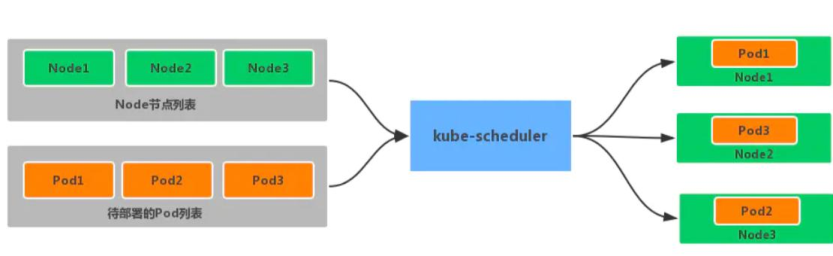

调度主要分为以下几个部分：

首先是预选过程，过滤掉不满足条件的节点，这个过程称为 Predicates

然后是优选过程，对通过的节点按照优先级排序，称之为 Priorities

最后从中选择优先级最高的节点，如果中间任何一步骤有错误，就直接返回错误Predicates 阶段首先遍历全部节点，过滤掉不满足条件的节点，属于强制性规则，这一阶段输出的所有满足要求的 Node 将被记录并作为第二阶段的输入，如果所有的节点都不满足条件，那么 Pod 将会一直处于 Pending 状态，直到有节点满足条件，在这期间调度器会不断的重试。

所以我们在部署应用的时候，如果发现有 Pod 一直处于 Pending 状态，那么就是没有满足调度条件的节点，这个时候可以去检查下节点资源是否可用。

Priorities 阶段即再次对节点进行筛选，如果有多个节点都满足条件的话，那么系统会按照节点的优先级(priorites)大小对节点进行排序，最后选择优先级最高的节点来部署 Pod应用。

下面是调度过程的简单示意图：

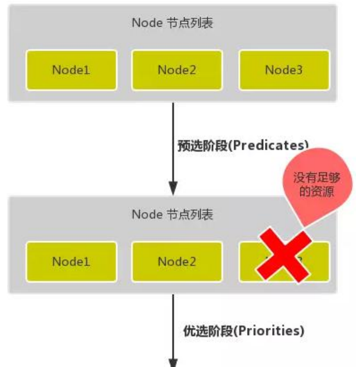

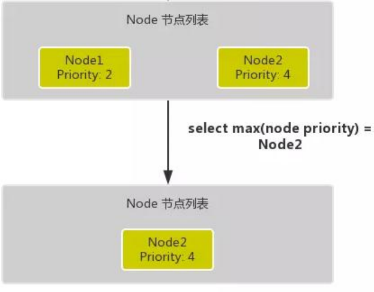

**更详细的流程**

首先，客户端通过 API Server 的 REST API 或者 kubectl 工具创建 Pod 资源API Server 收到用户请求后，存储相关数据到 etcd 数据库中调度器监听 API Server 查看为调度(bind)的 Pod 列表，循环遍历地为每个 Pod 尝试分配节点，这个分配过程就是我们上面提到的两个阶段：

预选阶段(Predicates)，过滤节点，调度器用一组规则过滤掉不符合要求的 Node 节点，比如 Pod 设置了资源的 request，那么可用资源比 Pod 需要的资源少的主机显然就会被过滤掉

优选阶段(Priorities)，为节点的优先级打分，将上一阶段过滤出来的 Node 列表进行打分，调度器会考虑一些整体的优化策略，比如把 Deployment 控制的多个 Pod 副本分布到不同的主机上，使用最低负载的主机等等策略

经过上面的阶段过滤后选择打分最高的 Node 节点和 Pod 进行 binding 操作，然后将结果存储到 etcd 中

最后被选择出来的 Node 节点对应的 kubelet 去执行创建 Pod 的相关操作其中 Predicates 过滤有一系列的算法可以使用，我们这里简单列举几个：

PodFitsResources：节点上剩余的资源是否大于 Pod 请求的资源

PodFitsHost：如果 Pod 指定了 NodeName，检查节点名称是否和 NodeName 匹配

PodFitsHostPorts：节点上已经使用的 port 是否和 Pod 申请的 port 冲突

PodSelectorMatches：过滤掉和 Pod 指定的 label 不匹配的节点

NoDiskConflict：已经 mount 的 volume 和 Pod 指定的 volume 不冲突，除非它们都是只读的

CheckNodeDiskPressure：检查节点磁盘空间是否符合要求

CheckNodeMemoryPressure：检查节点内存是否够用除了这些过滤算法之外，还有一些其他的算法，更多更详细的我们可以查看源码文件：`k8s.io/kubernetes/pkg/scheduler/algorithm/predicates/predicates.go`

而 Priorities 优先级是由一系列键值对组成的，键是该优先级的名称，值是它的权重值，同样，我们这里给大家列举几个具有代表性的选项：

LeastRequestedPriority：通过计算 CPU 和内存的使用率来决定权重，使用率越低权重越高，当然正常肯定也是资源是使用率越低权重越高，能给别的 Pod 运行的可能性就越大

SelectorSpreadPriority：为了更好的高可用，对同属于一个 Deployment 或者 RC 下面的多个 Pod 副本，尽量调度到多个不同的节点上，当一个 Pod 被调度的时候，会先去查找该 Pod 对应的 controller，然后查看该 controller 下面的已存在的 Pod，运行 Pod越少的节点权重越高

ImageLocalityPriority：就是如果在某个节点上已经有要使用的镜像节点了，镜像总大小值越大，权重就越高

NodeAffinityPriority：这个就是根据节点的亲和性来计算一个权重值，后面我们会详细讲解亲和性的使用方法

## 15.4 节点调度亲和性

节点亲和性规则：硬亲和性 required 、软亲和性 preferred。

硬亲和性规则不满足时，Pod 会置于 Pending 状态，软亲和性规则不满足时，会选择一个不匹配的节点。当节点标签改变而不再符合此节点亲和性规则时，不会将 Pod 从该节点移出，仅对新建的 Pod 对象生效

> 节点硬亲和性

requiredDuringSchedulingIgnoredDuringExecution

方式一：Pod 使用 spec.nodeSelector (基于等值关系)

方式二：Pod 使用 spec.affinity 支持 matchExpressions 属性 (复杂标签选择机制)

> 节点软亲和性

preferredDuringSchedulingIgnoredDuringExecution

柔性控制逻辑，当条件不满足时，能接受被编排于其他不符合条件的节点之上

权重 weight 定义优先级，1-100 值越大优先级越高

## 15.5 污点和容忍度

污点 taints 是定义在节点上的键值型属性数据，用于让节点拒绝将 Pod 调度运行于其上，除非 Pod 有接纳节点污点的容忍度容忍度 tolerations 是定义在 Pod 上的键值属性数据，用于配置可容忍的污点，且调度器将 Pod 调度至其能容忍该节点污点的节点上或没有污点的节点上

使用 s PodToleratesNodeTaints  预选策略和 y TaintTolerationPriority  优选函数完成该机制

节点亲和性使得 Pod 对象被吸引到一类特定的节点 (nodeSelector 和 affinity)污点提供让节点排斥特定 Pod 对象的能力

> 定义污点和容忍度

污点定义于 nodes.spec.taints 容忍度定义于 pods.spec.tolerations

语法： key=value:effect

> effect  定义排斥等级

`NoSchedule`，不能容忍，但仅影响调度过程，已调度上去的 pod 不受影响，仅对新增加的pod 生效。

`PreferNoSchedule`，柔性约束，节点现存 Pod 不受影响，如果实在是没有符合的节点，也可以调度上来

`NoExecute`，不能容忍，当污点变动时，Pod 对象会被驱逐

> 在 Pod  上定义容忍度时

等值比较 容忍度与污点在 key、value、effect 三者完全匹配

存在性判断 key、effect 完全匹配，value 使用空值

一个节点可配置多个污点，一个 Pod 也可有多个容忍度

> 管理节点的污点

同一个键值数据，effect 不同，也属于不同的污点

给节点添加污点：

```bash
kubectl taint node <node-name><key>=<value>:<effect>
kubectl taint node node2 node-type=production:NoShedule #举例
```

查看节点污点：

```bash
kubectl get nodes <nodename> -o go-template={{.spec.taints}}
```

删除节点污点:

```bash
kubectl taint node <node-name><key>[:<effect>]-
kubectl patch nodes <node-name> -p '{"spec":{"taints":[]}}'
kubectl taint node kube-node1 node-type=production:NoSchedule
kubectl get nodes kube-node1 -o go-template={{.spec.taints}}
```

删除 key 为 node-type，effect 为 NoSchedule 的污点

```bash
kubectl taint node kube-node1 node-type:NoSchedule-
```

删除 key 为 node-type 的所有污点

```bash
kubectl taint node kube-node1 node-type-
```

删除所有污点

```bash
kubectl patch nodes kube-node1 -p '{"spec":{"taints":[]}}'
```

# 16 核心技术 -- 集群安全机制 RBAC

## 16.1 基本概念

RBAC(Role-Based Access Control，基于角色的访问控制)在 k8s v1.5 中引入，在 v1.6 版本时升级为 Beta 版本，并成为 kubeadm 安装方式下的默认选项，相对于其他访问控制方式，新的 RBAC 具有如下优势：

1. 对集群中的资源和非资源权限均有完整的覆盖
2. 整个 RBAC 完全由几个 API 对象完成，同其他 API 对象一样，可以用 kubectl 或 API进行操作
3. 可以在运行时进行调整，无需重启 API Server要使用 RBAC 授权模式，需要在 API Server 的启动参数中加上--authorization-mode=RBAC

## 16.2 RBAC 原理和用法

2.1 RBAC 的 的 API  资源对象说明
RBAC 引入了 4 个新的顶级资源对象：`Role、ClusterRole、RoleBinding、ClusterRoleBinding`。同其他 API 资源对象一样，用户可以使用 kubectl 或者 API 调用等方式操作这些资源对象。

> 角色 (Role)

一个角色就是一组权限的集合，这里的权限都是许可形式的，不存在拒绝的规则。在一个命名空间中，可以用角色来定义一个角色，如果是集群级别的，就需要使用 `ClusterRole`了。角色只能对命名空间内的资源进行授权，下面的例子中定义的角色具备读取 Pod 的权限：

```yaml
kind: Role
apiVersion: rbac.authorization.k8s.io/v1
metadata:
  namespace: default
  name: pod-reader

rules:
- apiGroups: [""] # 空字符串表示核心 API 群
  resource: ["pods"]
  verbs: ["get", "watch", "list"]
```

rules 中的参数说明：

`apiGroup`：支持的 API 组列表，例如：APIVersion: batch/v1、APIVersion: extensions: v1、APIVersion: apps/v1 等

`resources`：支持的资源对象列表，例如：pods、deployments、jobs 等

`verbs`：对资源对象的操作方法列表，例如：get、watch、list、delete、replace 等

> 集群角色 (ClusterRole)

集群角色除了具有和角色一致的命名空间内资源的管理能力，因其集群级别的范围，还可
以用于以下特殊元素的授权。

集群范围的资源，例如 Node

非资源型的路径，例如/healthz

包含全部命名空间的资源，例如 pods

下面的集群角色可以让用户有权访问任意一个或所有命名空间的 secrets：

```yaml
kind: ClusterRole
apiVersion: rbac.authorization.k8s.io/v1
metadata:
  # name: secret-reader
  # ClusterRole 不受限于命名空间，所以省略了 namespace name 的定义
rules:
- apiGroups: [""]
  resources: ["secrets"]
  verbs: ["get", "watch", "list"]
```

> 角色绑定 (RoleBinding) 和集群角色绑定 (ClusterRoleBinding)

角色绑定或集群角色绑定用来把一个角色绑定到一个目标上，绑定目标可以是 User、Group 或者 Service Account。使用 RoleBinding 为某个命名空间授权，ClusterRoleBinding 为集群范围内授权。

RoleBinding 可以引用 Role 进行授权，下例中的 RoleBinding 将在 default 命名空间中把pod-reader 角色授予用户 jane，可以让 jane 用户读取 default 命名空间的 Pod：

```yaml
kind: RoleBinding
apiVersion: rbac.authorization.k8s.io/v1
metadata:
  name: read-pods
  namespace: default
subjects:
- kind: User
  name: jane
  apiGroup: rbac.authorization.k8s.io
roleRef:
  kind: Role
  name: pod-reader
  apiGroup: rbac.authorization.k8s.io
```

RoleBinding 也可以引用 ClusterRole，对属于同一命名空间内 ClusterRole 定义的资源主体进行授权。一种常见的做法是集群管理员为集群范围预先定义好一组角色(ClusterRole)，然后在多个命名空间中重复使用这些 ClusterRole。

使用 RoleBinding 绑定集群角色 secret-reader，使 dave 只能读取 development 命名空间中的 secret：

```yaml
kind: RoleBinding
apiVersion: rbac.authorization.k8s.io/v1
metadata:
  name: read-secrets
  namespace: development
subjects:
- kind: User
  name: dave
  apiGroup: rbac.authorization.k8s.io
roleRef:
  kind: ClusterRole
  name: secret-reader
  apiGroup: rbac.authorization.k8s.io
```

集群角色绑定中的角色只能是集群角色，用于进行集群级别或者对所有命名空间都生效授权。允许 manager 组的用户读取任意 namespace 中的 secret

```yaml
kind: ClusterRoleBinding
apiVersion: rbac.authorization.k8s.io/v1
metadata:
  name: read-secrets-global
subjects:
- kind: Group
  name: manager
  apiGroup: rbac.authorization.k8s.io
roleRef:
  kind: ClusterRole
  name: secret-reader
  apiGroup: rbac.authorization.k8s.io
```

> RBAC对资源的引用方式

多数资源可以用其名称的字符串来表达，也就是 Endpoint 中的 URL 相对路径，例如 pods。然后，某些 Kubernetes API 包含下级资源，例如 Pod 的日志(logs)。Pod 日志的 Endpoint是 GET /api/v1/namespaces/{namespaces}/pods/{name}/log。

Pod 是一个命名空间内的资源，log 就是一个下级资源。要在一个 RBAC 角色中体现，则需要用斜线/来分割资源和下级资源。若想授权让某个主体同时能够读取 Pod 和 Pod log，则可以配置 resources 为一个数组：

```yaml
kind: Role
apiVersion: rbac.authorization.k8s.io/v1
metadata:
  namespace: default
  name: pod-and-pod-logs-reader
rules:
- apiGroups: [""]
  resources: ["pods", "pods/log"]
  verbs: ["get", "list"]
```

资源还可以通过名字(ResourceName)进行引用。在指定 ResourceName 后，使用 get、delete、update、patch 动词的请求，就会被限制在这个资源实例范围内。例如下面的声明让一个主体只能对一个叫 my-configmap 的 configmap 进行 get 和 update 操作：

```yaml
kind: Role
apiVersion: rbac.authorization.k8s.io/v1
metadata:
  namespace: default
  name: configmap-updater
rules:
- apiGroups: [""]
  resources: ["configmap"]
  resourceNames: ["my-configmap"]
  verbs: ["update", "get"]
```

# 17 核心技术 -- Helm

[官方文档](https://helm.sh/zh/)

## 17.1 Helm 引入

K8S 上的应用对象，都是由特定的资源描述组成，包括 deployment、service 等。都保存各自文件中或者集中写到一个配置文件。然后 kubectl apply –f 部署。如果应用只由一个或几个这样的服务组成，上面部署方式足够了。而对于一个复杂的应用，会有很多类似上面的资源描述文件，例如微服务架构应用，组成应用的服务可能多达十个，几十个。如果有更新或回滚应用的需求，可能要修改和维护所涉及的大量资源文件，而这种组织和管理应用的方式就显得力不从心了。且由于缺少对发布过的应用版本管理和控制，使Kubernetes 上的应用维护和更新等面临诸多的挑战，主要面临以下问题：

1. 如何将这些服务作为一个整体管理
2. 这些资源文件如何高效复用 
3. 不支持应用级别的版本管理

## 17.2 Helm 介绍

Helm 是一个 Kubernetes 的包管理工具，就像 Linux 下的包管理器，如 yum/apt 等，可以
很方便的将之前打包好的 yaml 文件部署到 kubernetes 上。
Helm 有 3 个重要概念：

1. **helm**：一个命令行客户端工具，主要用于 Kubernetes 应用 chart 的创建、打包、发布和管理。
2. **Chart**：应用描述，一系列用于描述 k8s 资源相关文件的集合。
3. **Release**：基于 Chart 的部署实体，一个 chart 被 Helm 运行后将会生成对应的一个release；将在 k8s 中创建出真实运行的资源对象。

## 17.3 Helm v3 变化

2019 年 11 月 13 日， Helm 团队发布 Helm v3 的第一个稳定版本。

该版本主要变化如下：

架构变化：

1. 最明显的变化是 Tiller 的删除
2. Release 名称可以在不同命名空间重用
3. 支持将 Chart 推送至 Docker 镜像仓库中
4. 使用 JSONSchema 验证 chart values
5. 其他

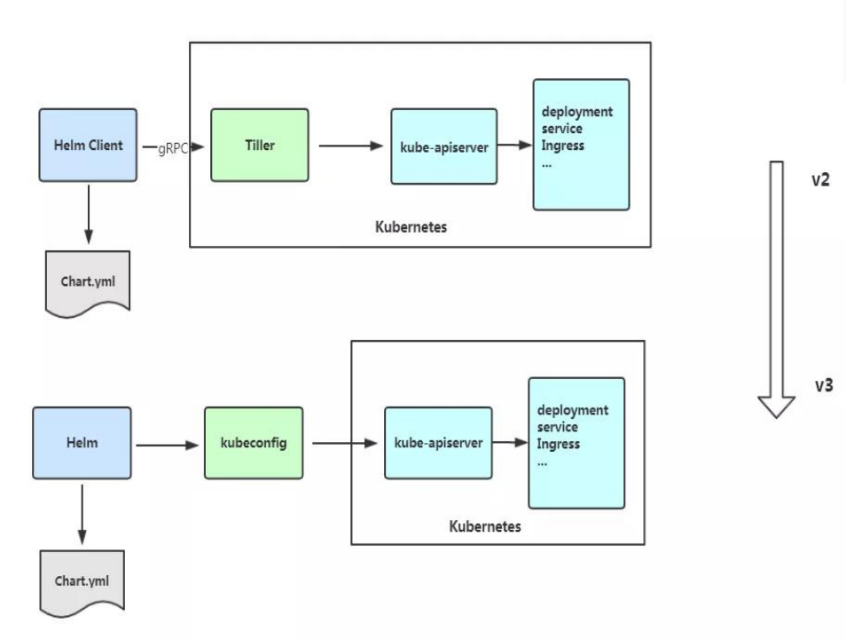

## 17.4 Helm 客户端

Helm 客户端下载地址：https://github.com/helm/helm/releases

解压移动到/usr/bin/目录即可。

```bash
wget https://get.helm.sh/helm-vv3.2.1-linux-amd64.tar.gz
tar zxvf helm-v3.2.1-linux-amd64.tar.gz
mv linux-amd64/helm /usr/bin/
```

|    命令    |                             描述                             |
| :--------: | :----------------------------------------------------------: |
| dependency |                       管理 chart 依赖                        |
|    get     | 下载一个 release。可用子命令：all、hooks、manifest、notes、values |
|  history   |                      获取 release 历史                       |
|  install   |                        安装一个 chart                        |
|    list    |                         列出 release                         |
|  package   |             将 chart 目录打包到 chart 存档文件中             |
|    pull    | 从远程仓库中下载 chart 并解压到本地 # helm pull stable/mysql --<br/>untar |
|    repo    | 添加，列出，移除，更新和索引 chart 仓库。可用子命令：add、index、<br/>list、remove、update |
|  rollback  |                        从之前版本回滚                        |
|   search   |         根据关键字搜索 chart。可用子命令：hub、repo          |
|    show    | 查看 chart 详细信息。可用子命令：all、chart、readme、values  |
|   status   |                     显示已命名版本的状态                     |
|  template  |                         本地呈现模板                         |
| uninstall  |                       卸载一个 release                       |
|  upgrade   |                       更新一个 release                       |
|  version   |                     查看 helm 客户端版本                     |

## 17.5 helm  基本使用

主要介绍三个命令：

* chart install
* chart upgrade
* chart rollback

```bash
#查找 chart
helm search repo weave

#查看 chrt 信息
helm show chart stable/mysql
#安装包
helm install ui stable/weave-scope
#查看发布状态
helm list

helm status ui
NAME: ui
LAST DEPLOYED: Thu May 2817:45:012020
NAMESPACE: default
STATUS: deployed
REVISION: 1
NOTES:
You should now be able to access the Scope frontend in your web browser, by
using kubectl port-forward:
kubectl -n default port-forward $(kubectl -n default get endpoints \
ui-weave-scope -o jsonpath='{.subsets[0].addresses[0].targetRef.name}')
8080:4040
then browsing to http://localhost:8080/.
For more details on using Weave Scope, see the Weave Scope documentation:
https://www.weave.works/docs/scope/latest/introducing/
#修改 service Type: NodePort 即可访问 ui
```

[chart构建，配置文档](https://helm.sh/zh/docs/topics/charts/)

## 17.6 chart模板

Helm 最核心的就是模板，即模板化的 K8S manifests 文件。

它本质上就是一个 Go 的 template 模板。Helm 在 Go template 模板的基础上，还会增加很多东西。如一些自定义的元数据信息、扩展的库以及一些类似于编程形式的工作流，例如条件语句、管道等等。这些东西都会使得我们的模板变得更加丰富。

有了模板，我们怎么把我们的配置融入进去呢？用的就是这个 values 文件。这两部分内容其实就是 chart 的核心功能。

[官方文档](https://helm.sh/zh/docs/chart_template_guide/getting_started/)

# 18 高可用集群(多master)

所有master请求发给load balancer，然后load balancer来分发给node节点。

## 18.1 高可用集群技术

1. `keepalived` 监控master的状态，为master分配虚拟ip
2. `haproxy` 做master的负载均衡

[部署步骤](./kubeadm_high_availability_cluster.md)